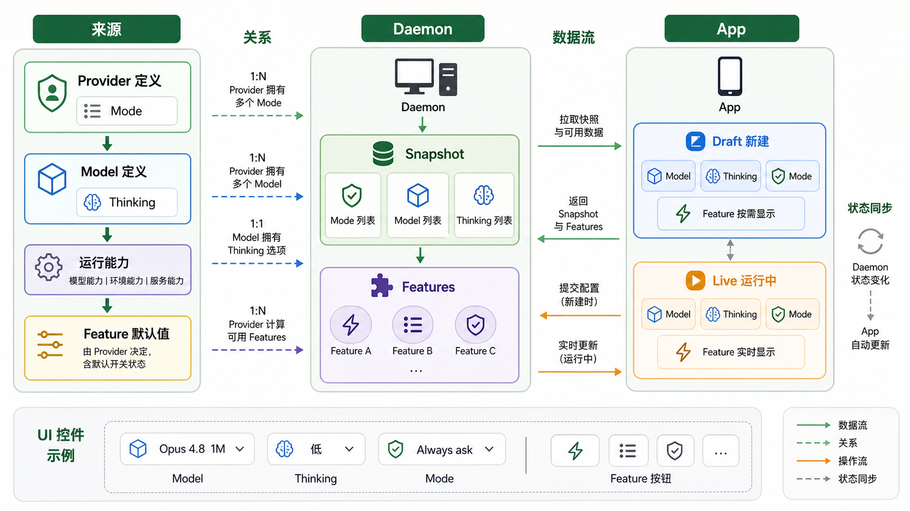

# Agent 控件数据流

本文说明 composer 底部 agent 控件的数据从哪里来、彼此怎么关联，以及 Draft 新建态和 Live 运行态的联动差异。



## 关系模型

这一排控件不是固定写死的一组按钮。它们由 provider 数据、model 数据、当前 draft 表单状态、运行中 agent snapshot，以及 provider 动态计算出的 features 共同决定。

App 通常不直接消费单个静态数组，而是消费 daemon 组装后的运行时数据。daemon 会把 provider 定义、provider 返回的 models、运行能力、feature 默认值和当前开关值整理成 App 可渲染的数据。

Provider 和 mode 关联。Provider 定义里声明这个 provider 有哪些 mode，以及默认 mode 是哪个。例如 Claude 通过 `CLAUDE_MODES` 声明 `default`、`auto`、`acceptEdits`、`plan`、`bypassPermissions`，并用 `defaultModeId: "default"` 默认选中 `Always Ask`。

Model 和 thinkingOptions 关联。每个 model 自己声明 thinking 选项。例如 `Opus 4.8 1M` 带 `low`、`medium`、`high`、`xhigh`、`max`。

Provider 和 model 通过 provider id 关联：

```ts
providerDefinition.id === model.provider
```

有些 provider 还会动态补充 models。Claude 除了内置模型列表，还会读取本机 `~/.claude/settings.json`，把其中的 model id 补成 `{ provider: "claude", id, label: id }`。

Feature 是 provider 根据当前 session config 动态算出来的控制项，不是 UI 写死，也不是简单挂在某个 model 或 mode 上。计算时会看这些字段：

```ts
{
  provider,
  cwd,
  modeId,
  model,
  thinkingOptionId,
  featureValues,
}
```

Provider 决定有哪些 feature；model、mode、运行能力和配置决定 feature 是否可用；`featureValues` 决定当前开关值。

## Draft 新建态

Draft 控件用于 agent 还没创建时。此时控件数据是一份本地表单状态，由 daemon 数据、用户偏好和初始值推导出来。

```text
useProvidersSnapshot(serverId, { cwd })
  -> useAgentFormState()
  -> useDraftAgentFeatures()
  -> buildDraftAgentControls()
  -> <DraftAgentControls />
```

当用户选择 provider 或 model 时，表单 reducer 会重新计算依赖字段：

```text
选择 provider
  -> 当前 provider 的 models
  -> selected model
  -> 当前 model 的 thinkingOptions
  -> selected thinking
  -> 当前 provider 的 modes
  -> selected mode
  -> 查询 draft features
```

Draft 的 features 是显式向 daemon 查询的：

```text
client.listProviderFeatures(draftConfig)
  -> list_provider_features_request
  -> session.handleListProviderFeaturesRequest()
  -> agentManager.listDraftFeatures(sessionConfig)
  -> provider.listFeatures(config)
  -> features[]
```

Draft 中的选择不会立刻修改运行中的 agent。用户提交时，这些值才会组成创建 agent 的 config。

## Live 运行态

Live 控件用于已经存在的 agent。App 从 `useSessionStore` 里读取当前 agent snapshot，然后用户每次操作都会发 RPC 修改 daemon。

```text
daemon agent session
  -> agent snapshot
  -> useSessionStore.sessions[serverId].agents[agentId]
  -> <AgentControls />
```

例如切换 model：

```text
选择 model
  -> client.setAgentModel(agentId, modelId)
  -> agentManager.setAgentModel()
  -> provider session 更新
  -> daemon emit agent snapshot
  -> App rerender
```

thinking、mode、feature 也是同一类回流：

```text
client.setAgentThinkingOption(...)
client.setAgentMode(...)
client.setAgentFeature(...)
```

运行中的 features 不走 Draft 查询。`AgentManager` 在发送 agent state 前，会从 provider session 读取 `agent.session.features`，同步到 `agent.features`，再进入 snapshot。

## Feature 控件

闪电和列表是 feature 控件，不是 model/mode 控件。

以 Codex 为例：

```text
fast_mode -> icon: "zap" -> 闪电
plan_mode -> icon: "list-todo" -> 列表
```

Codex 通过 `buildCodexFeatures({ modelId, fastModeEnabled, planModeEnabled, planModeAvailable })` 生成 features：

```text
model 支持 fast mode
  -> 返回 fast_mode

plan collaboration mode 可用
  -> 返回 plan_mode
```

App 拿到的是结构化数据：

```ts
[
  { id: "fast_mode", icon: "zap", value: true },
  { id: "plan_mode", icon: "list-todo", value: false },
]
```

然后 UI 把 `icon` 映射成 Lucide 图标：

```ts
const FEATURE_ICONS = {
  "list-todo": ListTodo,
  "shield-check": ShieldCheck,
  zap: Zap,
};
```

## Daemon 配置输入框默认控件

管理端可以通过 daemon config 下发一组新 agent 的默认控件值：

```ts
{
  agents: {
    lockedProviderModel: {
      provider: "codex",
      model: "gpt-5.5",
      modeId: "default",
      thinkingOptionId: "medium",
      featureValues: {
        fast_mode: true,
        plan_mode: false,
      },
    },
  },
}
```

这个配置会被持久化到 `$DOYA_HOME/config.json` 的 `agents.lockedProviderModel`。

这里有两层语义：

- `provider` / `model` 是锁定项：输入框不显示 provider/model selector，创建新 agent 时 daemon 也会强制覆盖成管理端配置。
- `modeId` / `thinkingOptionId` / `featureValues` 是默认值：输入框仍显示这些控件，初始值来自管理端配置，但用户可以在输入框里继续切换。

配置后，App 的 Draft 表单会先读取 daemon config，再把 provider/model 数据源强制切到锁定值，同时把其他控件作为初始值注入：

```text
useDaemonConfig(serverId)
  -> config.agents.lockedProviderModel
  -> useAgentFormState()
  -> selectedProvider / selectedModel 使用锁定值
  -> mode / thinking 使用配置值作为初始值
  -> useDraftAgentFeatures(initialFeatureValues)
  -> feature 控件使用配置值作为初始值
  -> DraftAgentControls 隐藏 provider/model selector，保留 mode/thinking/features
```

Live 运行态也会读取同一个 daemon config。如果存在锁定值，`AgentControls` 不再传 `onSelectModel`，所以 model selector 不显示；thinking、mode、feature 控件仍然保留。

管理端弹窗没有重新做一套表单 UI，而是复用输入框同一套链路：

```text
useAgentFormState({ ignoreDaemonProviderModelLock: true })
  -> useDraftAgentFeatures()
  -> buildDraftAgentControls()
  -> <DraftAgentControls />
  -> patchControlDaemonConfig({ agents.lockedProviderModel })
```

其中 `ignoreDaemonProviderModelLock: true` 只用于管理端编辑弹窗，避免“正在编辑锁定配置”时被已有锁定值隐藏 provider/model。

Daemon 侧不是只靠 UI 隐藏。`AgentManager.normalizeConfig()` 会在创建新 agent、查询 draft commands、查询 draft features 时覆盖传入的 provider/model。这样旧客户端即使继续传自己选的 provider/model，也会被 daemon 改成管理端配置。mode、thinking 和 features 不在服务端强制覆盖，它们由新客户端按输入框默认值带入，用户仍可在创建前切换。

运行中的旧 agent 不会因为锁定配置被强制跨 provider resume/reload。锁定主要作用于“后续新分配到这个 daemon 的 agent”。如果客户端尝试对运行中 agent 调 `setAgentModel()`，daemon 会拒绝和锁定值不一致的修改。

## 代码位置

Provider 和 mode 定义：

- `packages/protocol/src/provider-manifest.ts`

Claude model 和 `settings.json` 动态补充：

- `packages/server/src/server/agent/providers/claude/models.ts`

Draft 表单状态和依赖字段推导：

- `packages/app/src/hooks/use-agent-form-state.ts`
- `packages/app/src/provider-selection/resolve-agent-form.ts`
- `packages/app/src/composer/draft/input-draft-core.ts`

Daemon 配置输入框默认控件：

- `packages/protocol/src/messages.ts`
- `packages/server/src/server/persisted-config.ts`
- `packages/server/src/server/daemon-config-store.ts`
- `packages/server/src/server/config.ts`
- `packages/server/src/server/bootstrap.ts`
- `packages/server/src/server/agent/agent-manager.ts`
- `packages/app/src/app/admin/daemons.tsx`
- `packages/app/src/utils/daemon-config.ts`
- `packages/app/src/hooks/use-agent-form-state.ts`
- `packages/app/src/hooks/use-draft-agent-features.ts`
- `packages/app/src/composer/draft/input-draft.ts`
- `packages/app/src/composer/agent-controls/index.tsx`

Draft features 查询：

- `packages/app/src/hooks/use-draft-agent-features.ts`
- `packages/client/src/daemon-client.ts`
- `packages/server/src/server/session.ts`
- `packages/server/src/server/agent/agent-manager.ts`

Codex feature 定义和运行时计算：

- `packages/server/src/server/agent/providers/codex-feature-definitions.ts`
- `packages/server/src/server/agent/providers/codex-app-server-agent.ts`

Live agent feature 同步：

- `packages/server/src/server/agent/agent-manager.ts`

控件渲染：

- `packages/app/src/composer/index.tsx`
- `packages/app/src/composer/agent-controls/index.tsx`
- `packages/app/src/composer/agent-controls/mode-control.tsx`
- `packages/app/src/components/combined-model-selector.tsx`

## 结论汇总

```text
Provider -> Modes
Model -> ThinkingOptions
Model.provider -> Provider id
Provider + 当前 session config -> Features[]
```

Draft 新建态是本地表单状态：从 provider snapshot、用户偏好、初始值和当前 workspace 推导控件值，提交时才创建 agent。

Live 运行态是真实 agent 状态：控件读取 agent snapshot，用户操作先 RPC 到 daemon，再由新的 snapshot 回流刷新 UI。

Feature 是 provider 动态计算出的控制项。Provider 决定有哪些 feature，model/mode/runtime 能力决定是否可用，`featureValues` 决定当前开关值。

当 daemon 配置了 `agents.lockedProviderModel` 时，provider/model 由管理端决定：Draft 和 Live 输入框都不显示 provider/model selector，daemon 也会在服务端覆盖新建 agent 的 provider/model，并拒绝运行中 agent 切到不符合锁定配置的 model。mode、thinking、feature 也可以在管理端配置，但它们是输入框默认值，不是服务端锁定项；输入框仍显示并允许用户切换。
