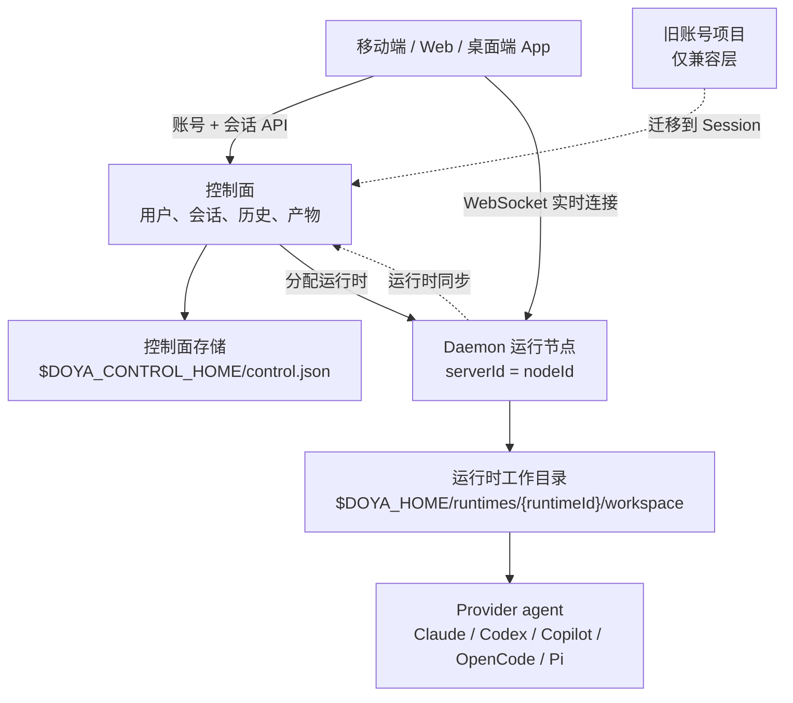

# Architecture

Doya is a client-server system for monitoring and controlling local AI coding agents. The daemon runs on your machine, manages agent processes, and streams their output in real time over WebSocket. Clients (mobile app, CLI, desktop app) connect to the daemon to observe and interact with agents.

Your code never leaves your machine. Doya is local-first.

The north-star product shape is session-centered: users create and reopen
sessions, while daemon nodes, runtimes, workspace directories, and ports stay
internal. See [product shape](product-shape.md) and
[cloud agent architecture](cloud-agent-architecture.md).

## System overview

```
┌─────────────┐    ┌─────────────┐    ┌─────────────┐
│  Mobile App  │    │     CLI     │    │ Desktop App │
│   (Expo)     │    │ (Commander) │    │ (Electron)  │
└──────┬───────┘    └──────┬──────┘    └──────┬──────┘
       │                   │                  │
       │    WebSocket      │    WebSocket     │    Managed subprocess
       │    (direct or     │    (direct)      │    + WebSocket
       │     via relay)    │                  │
       └───────────┬───────┴──────────────────┘
                   │
            ┌──────▼──────┐
            │   Daemon    │
            │  (Node.js)  │
            └──────┬──────┘
                   │
      ┌────────────┼────────────┬────────────┬────────────┐
      │            │            │            │            │
┌─────▼─────┐ ┌───▼────┐ ┌──────▼─────┐ ┌────▼─────┐ ┌────▼────┐
│  Claude   │ │ Codex  │ │  Copilot   │ │ OpenCode │ │   Pi    │
│  Agent    │ │ Agent  │ │   Agent    │ │  Agent   │ │ Agent   │
│  SDK      │ │ Server │ │    ACP     │ │          │ │         │
└───────────┘ └────────┘ └────────────┘ └──────────┘ └─────────┘
```

目标态：以 Session 为中心的运行时视图：



## Components at a glance

- **Control plane:** Owns users, sessions, durable message history, artifact metadata, file snapshots, daemon node inventory, and runtime allocation records. The local implementation lives in `packages/control`.
- **Daemon:** Runtime node that spawns and manages agent processes and exposes the WebSocket API.
- **Provider capability:** A daemon-scoped execution capability such as Claude,
  Codex, Copilot, OpenCode, or Pi. Provider availability is not global; each
  daemon reports whether that provider is installed, authenticated, enabled, and
  which models it can run.
- **App:** Cross-platform Expo client for iOS, Android, web, and the shared UI used by desktop.
- **CLI:** Terminal interface for agent workflows that can also start and manage the daemon.
- **Desktop app:** Electron wrapper around the web app that bundles and auto-manages its own daemon.
- **Relay:** Optional encrypted bridge for remote access without opening ports directly.

## Account Workspaces

The daemon includes a lightweight account/workspace compatibility layer for local
multi-user flows. Registration creates a user record and an assigned workspace
directory under `$DOYA_HOME/accounts/workspaces/{workspaceId}`. Creating a
project from the app creates a subdirectory inside that workspace, then opens it
through the normal project/workspace and agent lifecycle. See
[multi-tenant](multi-tenant/README.md) for the current model.

That account/workspace model is transitional. New durable work should be modeled
as control-plane sessions. `accounts.projects.cwd` is a legacy runtime path, not
the owner of user-visible session history.

## Packages

### `packages/control` — The local control plane

Owns durable user/session state for the session-centered model:

- Account registration/login and stored access tokens
- Sessions, session messages, artifact metadata, and file snapshots
- Daemon node inventory and internal runtime auth tokens
- Daemon-scoped provider capability snapshots for scheduling
- Runtime allocation records and session-agent bindings
- Runtime sync ingestion from daemon nodes

The local store is file-backed at `$DOYA_CONTROL_HOME/control.json` by default.
Daemon-local account project data under `$DOYA_HOME/accounts` is a compatibility
layer, not the owner of new durable session history.

Runtime allocation is provider-aware in the target architecture. A new Session
selects a provider/model first, then the control-plane scheduler chooses a
daemon that can run that provider/model. There is no default daemon concept for
new runtime placement: the selected daemon must be online, non-draining,
provider-enabled, provider-available, model-compatible, and under load limits.
The selected `nodeId`, `providerId`, `modelId`, and `selectionReason` are stored
on the RuntimeAllocation so the admin UI can explain why a session landed on a
daemon.

During migration, legacy non-control workspaces may still use the active direct
host. Control sessions and AI creation must ask the scheduler before opening a
runtime workspace.

When no explicit local daemon override is configured, app startup also asks the
control-plane scheduler for the initial runtime host. This bootstrap selection
does not require an account/control session; authentication is still required
for creating user sessions and allocating workdir/runtime resources.

### `packages/server` — The daemon

The runtime node for Doya. A Node.js process that:

- Listens for WebSocket connections from clients
- Manages agent lifecycle (create, run, stop, resume, archive)
- Reports daemon-scoped provider capability: enabled state, availability,
  models, versions, and recent provider errors
- Streams agent output in real time via a timeline model
- Exposes runtime HTTP APIs for session workdirs and runtime workspaces
- Exposes an MCP server for agent-to-agent control
- Optionally connects outbound to a relay for remote access

All paths are under `packages/server/src/`.

**Key modules:**

| Module                          | Responsibility                                                               |
| ------------------------------- | ---------------------------------------------------------------------------- |
| `server/bootstrap.ts`           | Daemon initialization: HTTP server, WS server, agent manager, storage, relay |
| `server/websocket-server.ts`    | WebSocket connection management, hello handshake, binary frame routing       |
| `server/session.ts`             | Per-client session state, timeline subscriptions, terminal operations        |
| `server/agent/agent-manager.ts` | Agent lifecycle state machine, timeline tracking, subscriber management      |
| `server/agent/agent-storage.ts` | File-backed JSON persistence at `$DOYA_HOME/agents/`                         |
| `server/agent/mcp-server.ts`    | MCP server for sub-agent creation, permissions, timeouts                     |
| `server/agent/providers/`       | Provider adapters (see "Agent providers" below)                              |
| `server/runtime-api.ts`         | Runtime workspace create/attach/stop/status API for control allocations      |
| `server/user-workspace-api.ts`  | Daemon-local user workspace/session workdir allocation API                   |
| `server/control-timeline-sync.ts` | Posts labeled agent timeline events back to the control plane              |
| `server/relay-transport.ts`     | Outbound relay connection with E2E encryption                                |
| `server/schedule/`              | Cron-based scheduled agents                                                  |
| `server/loop-service.ts`        | Looping agent runs that retry until an exit condition                        |
| `server/chat/`                  | Chat rooms for agent-to-agent and human-to-agent messaging                   |

### `packages/protocol` — Wire schemas and shared protocol types

The source of truth for WebSocket messages, binary frame codecs, endpoint parsing,
agent timeline types, provider config schemas, and other values shared by daemon
and clients. Server, app, CLI, and `@getdoya/client` all depend on this package;
it does not depend on the server.

### `packages/client` — Daemon client library and SDK facade

Owns the low-level daemon WebSocket driver plus the higher-level `DoyaClient`
facade. App and CLI may import the low-level driver from
`@getdoya/client/internal/daemon-client` during migration, while new SDK-shaped
code imports from `@getdoya/client`.

### `packages/app` — Mobile + web client (Expo)

Cross-platform React Native app that connects to one or more daemons.

- Expo Router navigation (`/h/[serverId]/workspace/[workspaceId]`, `/h/[serverId]/agent/[agentId]`, etc.)
- `HostRuntimeController` manages saved host connections, reconnection, and per-host runtime state
- Host runtime connections are lazy: boot loads the saved host registry, but WebSocket connection starts only when a route or workflow targets a specific `serverId`. Host lists, settings summaries, and admin overview screens must not connect every saved daemon just because they render the list.
- `SessionContext` wraps the daemon client for the active session
- Composer UI and submit/draft behavior live in `packages/app/src/composer/`; screens and panels should integrate it from there instead of dropping composer internals into `components/`, `hooks/`, or `screens/workspace/`
- Timeline reducers in `timeline/session-stream-reducers.ts` handle compaction, gap detection, sequence-based deduplication
- Timeline sync correctness is documented in [docs/timeline-sync.md](timeline-sync.md): live streams are for immediacy, `fetch_agent_timeline_request` is authoritative, and catch-up is paged but complete.
- Messages that mix full agent prompts with special rendered chat UI use [Doya Message Markup](doya-message-markup.md).
- Voice features: dictation (STT) and voice agent (realtime)

### `packages/cli` — Command-line client

Commander.js CLI with Docker-style commands. Common agent operations are also exposed at the top level (e.g. `doya ls`, `doya run`).

- `doya agent ls/run/import/attach/logs/stop/delete/send/inspect/wait/archive/reload/update/mode`
- `doya daemon start/stop/restart/status/pair/set-password`
- `doya chat ls/create/inspect/post/read/wait/delete`
- `doya terminal ls/create/capture/send-keys/kill`
- `doya loop run/ls/inspect/logs/stop`
- `doya schedule create/ls/inspect/update/pause/resume/run-once/logs/delete`
- `doya permit allow/deny/ls`
- `doya provider ls/models`
- `doya worktree create/ls/archive`
- `doya speech …`

Communicates with the daemon via the same WebSocket protocol as the app.

### `packages/relay` — E2E encrypted relay

Enables remote access when the daemon is behind a firewall.

- Curve25519 ECDH key exchange + XSalsa20-Poly1305 (NaCl `box`) encryption
- Relay server is zero-knowledge — it routes encrypted bytes, cannot read content
- Client and daemon channels with identical API (`createClientChannel`, `createDaemonChannel`)
- Pairing via QR code transfers the daemon's public key to the client
- Self-hosted relays opt into TLS with `daemon.relay.useTls` or `DOYA_RELAY_USE_TLS=true`; the public (client-facing) TLS setting can be overridden independently via `daemon.relay.publicUseTls` or `DOYA_RELAY_PUBLIC_USE_TLS`

See [SECURITY.md](../SECURITY.md) for the full threat model.

### `packages/desktop` — Desktop app (Electron)

Electron wrapper for macOS, Linux, and Windows.

- Can spawn the daemon as a managed subprocess
- Native file access for workspace integration
- Same WebSocket client as mobile app

### `packages/website` — Marketing site

TanStack Router + Cloudflare Workers. Serves doya.sh.

## WebSocket protocol

All clients speak the same WebSocket protocol over a single connection that mixes JSON text frames and a small binary framing for terminal streams. Schemas live in `packages/protocol/src/messages.ts`.

**Handshake:**

```
Client → Server:  WSHelloMessage {
                    type: "hello",
                    clientId,
                    clientType: "mobile" | "browser" | "cli" | "mcp",
                    protocolVersion,
                    appVersion?,
                    capabilities?: { voice?, pushNotifications?, ... },
                  }
Server → Client:  status message with payload { status: "server_info",
                    serverId, hostname, version, capabilities?, features }
```

There is no dedicated welcome message; the server emits a `status` session message after accepting the hello, then begins streaming. The session stores client capabilities from the hello and rehydrates them on reconnect, so the wire boundary can ask one question: `session.supports(...)`.

**Top-level WS envelopes** are `hello`, `recording_state`, `ping`/`pong`, and `session` (which wraps the rich union of session messages).

Client liveness checks use the top-level JSON `ping`/`pong` envelope, not a session RPC and not RFC6455 protocol ping. The app runs through browser and React Native WebSocket APIs, which do not expose protocol ping, so this envelope is the portable way to test the direct or relay data path. Session RPC timeouts are operation failures and must not be treated as proof that the socket is dead.

New session RPCs use dotted names with `.request` and `.response` suffixes, such as `checkout.github.set_auto_merge.request` and `checkout.github.set_auto_merge.response`. See [rpc-namespacing.md](rpc-namespacing.md) for the convention and migration rules for older flat RPC names.

**Notable session message types:**

- `agent_update` — Agent state changed (status, title, labels)
- `agent_stream` — New timeline event from a running agent
- `workspace_update`, `script_status_update`, `workspace_setup_progress` — Workspace state
- `agent_permission_request` / `agent_permission_resolved` — Tool-call permission flow
- `agent_deleted`, `agent_archived`, `agent_status`, `agent_list`
- `checkout_status_update`, `checkout_diff_update`, and the full `checkout_*` request/response set for git operations
- Terminal subscribe/input/capture commands
- Voice/dictation streaming events (`dictation_stream_*`, `assistant_chunk`, `audio_output`, `transcription_result`)
- Request/response pairs for fetch, list, create, etc., correlated by `requestId`; failures use `rpc_error`

**Binary frames (terminal stream protocol):**

Terminal I/O is sent as binary WebSocket frames decoded by `decodeTerminalStreamFrame` in `shared/binary-frames/terminal.ts`. The layout is:

- 1-byte opcode: `Output (0x01)`, `Input (0x02)`, `Resize (0x03)`, `Snapshot (0x04)`
- 1-byte slot: terminal slot id
- variable payload: bytes for output/input, JSON-encoded `{ rows, cols }` for resize, terminal snapshot for snapshot

Terminal PTY size is last-interacting-client-wins. A client claims the PTY size only when its terminal viewport genuinely changes size or the user focuses/taps the terminal. Passive rendering work — attaching, restoring visibility, font settling, renderer refits, or just looking at a visible terminal — must not send a resize frame. The server does not broadcast resize ownership; the resized PTY redraws through normal output, and every attached client renders that output in its own local viewport.

There is also a separate file-transfer binary frame format in the same directory, used for download/upload streams.

### Compatibility rules

- WebSocket schemas are append-only. Add fields, do not remove fields, and never make optional fields required.
- New wire enum values must be gated at serialization with `session.supports(CLIENT_CAPS.someCapability)`.
- `Session` stores client capabilities from the `hello` handshake and rehydrates them on reconnect, so the wire boundary can ask one question: `session.supports(...)`.

Example: adding a new enum value

```ts
// 1. Add CLIENT_CAPS.newThing = "new_thing"
// 2. Let new clients advertise it in WS hello
// 3. Keep the shared producer schema strict
// 4. Gate the new emitted value: session.supports(CLIENT_CAPS.newThing) ? "new_value" : "old_value"
```

## Agent lifecycle

The lifecycle states are defined in `shared/agent-lifecycle.ts`:

```
initializing → idle ⇄ running
        ↓       ↓        ↓
              error
                ↓
              closed
```

- `initializing` — provider session is being created
- `idle` — has a live session, awaiting the next prompt
- `running` — provider is currently producing a turn
- `error` — last attempt failed; session is still attached
- `closed` — terminal state, no live session

`ManagedAgent` is a discriminated union over those lifecycle tags. Notes:

- **AgentManager** is the source of truth for agent state and broadcasts updates to all subscribers
- Timeline is append-only with epochs (each run starts a new epoch). Storage uses sequence numbers for client-side dedup; the default fetch page is 200 items
- Timeline row `timestamp` values are canonical daemon-owned timestamps. Providers may supply original replay timestamps, but clients must not guess timestamp trust or hide time UI based on local clock heuristics.
- Events stream to connected clients in real time; correctness is backed by authoritative timeline fetches and paged-to-completion catch-up.
- Agent state persists to `$DOYA_HOME/agents/{cwd-with-dashes}/{agent-id}.json` (timeline rows live alongside the record)

## Agent providers

Each provider implements the `AgentClient` interface in `agent/agent-sdk-types.ts`. Provider implementations live in `agent/providers/`.

The built-in, user-facing providers are Claude Code, Codex, Copilot, OpenCode, and Pi. Additional adapters exist in the same directory for ACP-compatible agents and internal use:

| Provider           | Wraps                                | Session format                                     |
| ------------------ | ------------------------------------ | -------------------------------------------------- |
| Claude (`claude/`) | Anthropic Agent SDK                  | `~/.claude/projects/{cwd}/{session-id}.jsonl`      |
| Codex              | Codex AppServer (`codex-app-server`) | `~/.codex/sessions/{date}/rollout-{ts}-{id}.jsonl` |
| Copilot            | GitHub Copilot via ACP               | Provider-managed                                   |
| OpenCode           | OpenCode server / CLI                | Provider-managed                                   |
| Cursor             | ACP wrapper (`acp-agent`)            | Provider-managed                                   |
| Generic ACP        | ACP wrapper                          | Provider-managed                                   |
| Pi                 | Local Pi RPC process                 | Provider-managed                                   |
| Mock load test     | In-process fake                      | In-memory                                          |

All providers:

- Handle their own authentication (Doya does not manage API keys)
- Support session resume via persistence handles
- Map tool calls to a normalized `ToolCallDetail` type
- Expose provider-specific modes (plan, default, full-access)

## Data flow: running an agent

1. Client sends `CreateAgentRequestMessage` with config (prompt, cwd, provider, model, mode)
2. Session routes to `AgentManager.create()`
3. AgentManager creates a `ManagedAgent`, initializes provider session
4. Provider runs the agent → emits `AgentStreamEvent` items
5. Events append to the agent timeline, broadcast to all subscribed clients
6. Tool calls are normalized to `ToolCallDetail` (shell, read, edit, write, search, etc.)
7. Permission requests flow: agent → server → client → user decision → server → agent

## Storage

`$DOYA_HOME` defaults to `~/.doya`. The most important files:

```
$DOYA_HOME/
├── agents/{cwd-with-dashes}/{agent-id}.json   # Agent record + persisted timeline rows
├── projects/projects.json                      # Project registry
├── projects/workspaces.json                    # Workspace registry
├── chat/                                       # Chat rooms
├── schedules/                                  # Scheduled-agent definitions and runs
├── loops/                                      # Loop runs and logs
├── config.json                                 # Daemon config (mutable)
├── daemon-keypair.json                         # Daemon identity for relay/E2EE
├── push-tokens.json                            # Mobile push tokens
├── doya.sock / doya.pid                      # Local IPC socket and pidfile
└── daemon.log                                  # Daemon trace logs (rotated)
```

## Deployment models

1. **Local daemon** (default): `doya daemon start` on `127.0.0.1:6767`
2. **Managed desktop**: Electron app spawns daemon as subprocess
3. **Remote + relay**: Daemon behind firewall, relay bridges with E2E encryption
