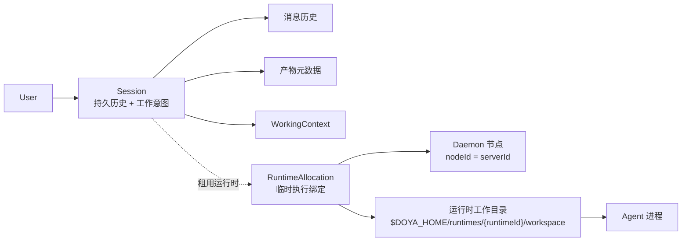
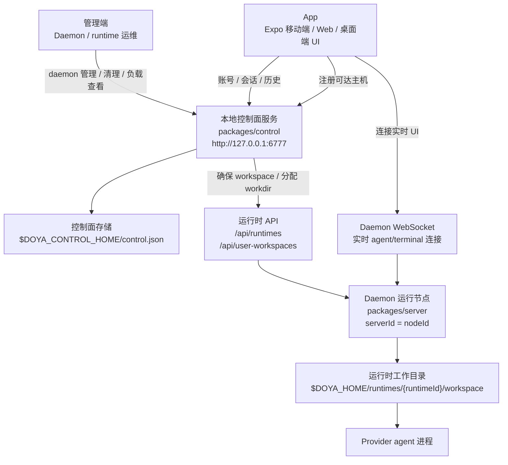
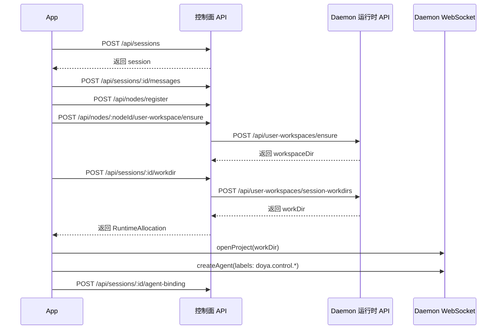
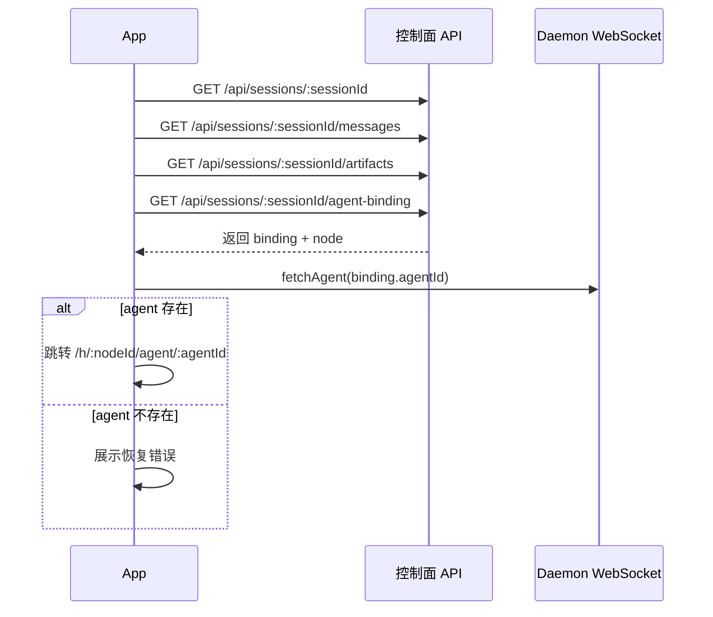
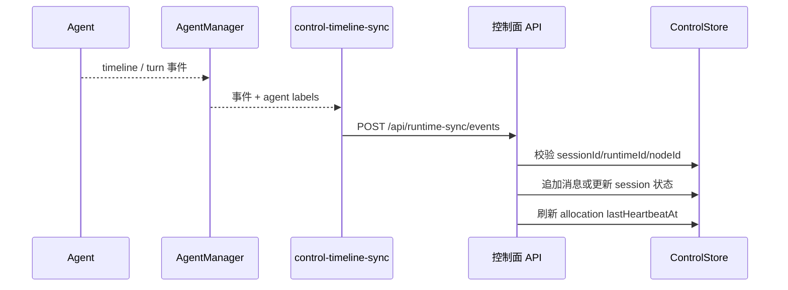

# Cloud Agent Architecture

Doya 的目标形态是 session-centered 的 cloud agent workspace。普通用户创建和继续的是 Session；daemon nodes、runtime allocations、workspace directories 和 provider processes 都是平台内部实现。

## 产品模型



用户模型：

```text
User
└── Session
    ├── working context
    ├── messages
    ├── artifacts
    └── status / approvals / results
```

内部模型：

```text
Session
└── RuntimeAllocation
    ├── daemon node (nodeId = daemon serverId)
    ├── runtime id
    ├── workspaceDir
    └── agent process
```

Session 是持久历史和工作意图。RuntimeAllocation 是一次可丢弃的运行绑定；daemon node 被删除或替换时，session 历史仍然存在。

`daemon_nodes.id` is the stable daemon `serverId`, not a separate database row id. The app uses that `nodeId` to locate the matching HostRuntime connection before opening a runtime workspace.

The first user message may carry `agentConfig` metadata for the intended
provider, model, mode, thinking option, and feature values. When a runtime must
be rebuilt, the app uses that persisted session intent instead of defaulting to
a daemon-local provider.

## 当前迁移规则

短期本地开发运行一个独立的 local control service，默认监听
`127.0.0.1:6777`。命名和数据归属必须按 control/runtime 分开：

- Control API 管用户、sessions、messages、artifacts、working context。
- Runtime API 管 runtime workspace、agent 进程和 live attach。



The local implementation lives in `packages/control` and exposes `/api/*`
routes. Point the app at it with
`EXPO_PUBLIC_CONTROL_API_URL=http://127.0.0.1:6777`. The store lives at
`$DOYA_CONTROL_HOME/control.json` and defaults to
`~/.doya-control/control.json` when `DOYA_CONTROL_HOME` is unset.

管理端也通过 Control API 工作。它不直接绕过 control plane 操作 daemon；daemon
添加、默认 daemon、draining/offline 状态、runtime 清理、用户工作目录清理和负载观察都应
通过 control plane 记录和调度，以便权限、审计和 Session 归属保持一致。

当前管理端 API 边界：

- Control `GET /api/admin/daemon-overview` 聚合 daemon nodes、负载快照、用户 workspace、Session、RuntimeAllocation 和 SessionAgentBinding。
- Control `PATCH /api/admin/default-daemon` 设置新 Session 的首选 daemon。
- Control `PATCH /api/admin/nodes/:nodeId` 标记 daemon `online` / `offline` / `draining`。
- Control `GET /api/admin/nodes/:nodeId/config` / `PATCH /api/admin/nodes/:nodeId/config` 代理读取和修改单个 daemon 的编排配置。
- Control `POST /api/admin/nodes/:nodeId/cleanup-sessions` 批量清理选中的会话运行痕迹。
- Daemon `GET /api/admin/daemon/load` 返回 CPU load average、内存、磁盘和 uptime。
- Daemon `GET /api/admin/daemon/config` / `PATCH /api/admin/daemon/config` 暴露该 daemon 的 Doya tools 注入和追加系统提示词配置。
- Daemon `DELETE /api/user-workspaces/session-workdirs` 只删除该用户 workspace 下指定 Session 的 workdir。

When the app registers a reachable direct daemon node, it may include the
daemon password as an internal runtime auth token. Control stores that token for
server-to-daemon Runtime API calls but strips it from node responses; it is not
part of the user-facing Session model.

Session title/status/delete are control-plane lifecycle operations
(`PATCH /api/sessions/:sessionId`, `DELETE /api/sessions/:sessionId`). They must
not call legacy account project APIs, because a session is the user history
record while a project `cwd` is only a compatibility/runtime path.
In the app, account/session auth remains in `account/account-api.ts`; legacy
project cwd mutations live in `account/account-project-api.ts`; control-plane
session/runtime calls live in `control/control-api.ts`.

历史和新建入口应逐步从 `accounts.projects` 迁到 `sessions`。`AccountProjectRecord.cwd` 只能作为 legacy compatibility 字段，不应驱动新的 session 打开流程。

## 新建流程



## 重开流程

打开历史 session 时：

1. App lists control sessions in the user-facing history/project list. Selecting
   one routes to `/session/:sessionId`, not to legacy project settings.
2. App 从 Control API 读取 session/messages/artifacts。
3. App registers reachable direct daemon hosts as control `daemon_nodes`.
4. App reads the active control agent binding, registers reachable direct daemon
   hosts as control `daemon_nodes`, and confirms the bound agent still exists on
   that daemon.
5. App uses `node.id` to find the HostRuntime client and navigates to the bound
   agent when it is still live.
6. Creating a new control session allocates a session workdir through the
   control API; the selected daemon creates the runtime workspace under
   `$DOYA_HOME/runtimes/{runtimeId}/workspace`.

Target runtime leasing still needs the full scheduler loop: probe an active
`RuntimeAllocation` against `/api/runtimes/:runtimeId/status`, mark missing or
unreachable allocations `lost`, then schedule a replacement runtime from the
session `workingContext`.

Control session messages may contain an internal agent binding for a live
runtime. The app must still confirm that the bound agent exists on that daemon
before navigating to it. Today a missing bound agent is reported as a restore
error. Target behavior is to treat the binding as stale and create a new agent
in the current runtime workspace using the persisted `agentConfig` from the
first user message.

这保证删除 daemon node 不会删除用户历史。



## 时间线同步

Agents created for a control session carry internal labels:

- `doya.control.sessionId`
- `doya.control.runtimeId`
- `doya.control.nodeId`
- `doya.control.apiBaseUrl`

The daemon reads those labels in `AgentManager.onRawStreamEvent` and posts live
timeline events to `POST /api/runtime-sync/events`. Runtime artifact metadata
is accepted through `POST /api/runtime-sync/artifacts`. The control API verifies
the `(sessionId, runtimeId, nodeId)` tuple against an existing
`RuntimeAllocation` before appending messages or upserting artifact metadata.
Timeline `artifact` items are indexed into control `artifacts` directly so the
historical artifact list is not owned by any daemon-local runtime.
Turn lifecycle events update the control session status: `turn_started` marks
the session `running`, `turn_completed` marks it `done`, `turn_failed` marks it
`error`, and `turn_canceled` returns it to `idle`.

Current daemon runtime preparation:

- `generated_workspace`: creates an empty runtime workspace.
- `git`: clones `repoUrl` into the runtime workspace, then checks out `branch` and/or `baseCommit` when provided.
- `uploaded_files`: control loads the referenced file snapshot and sends the files to the selected daemon; the daemon restores them under the runtime workspace with path traversal checks.


