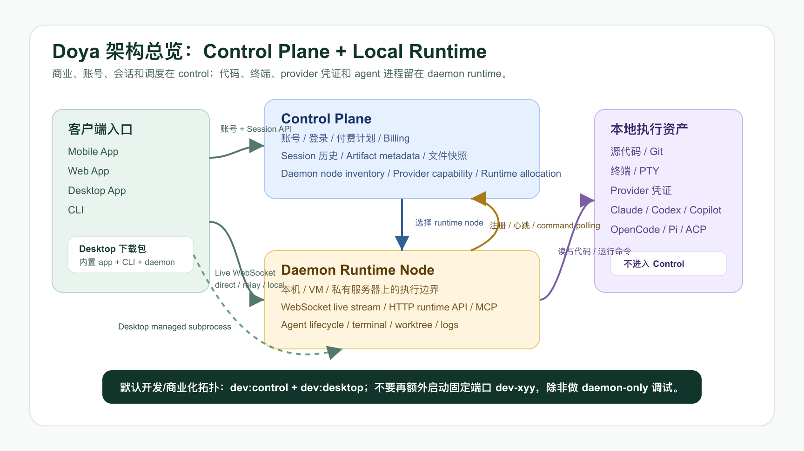
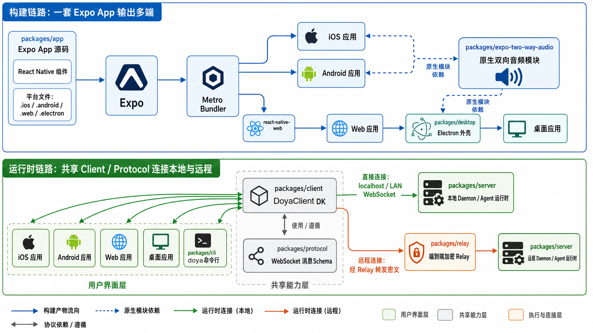
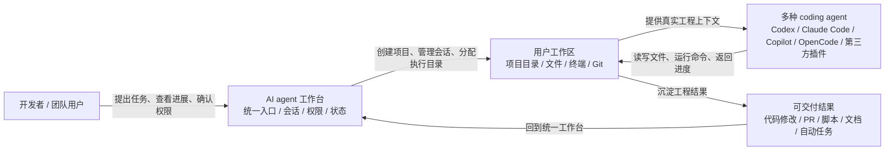
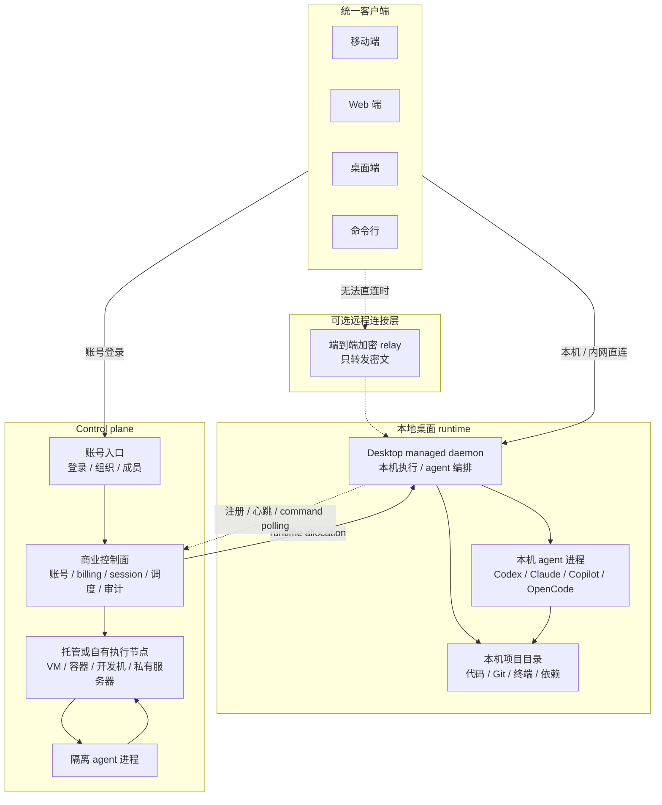
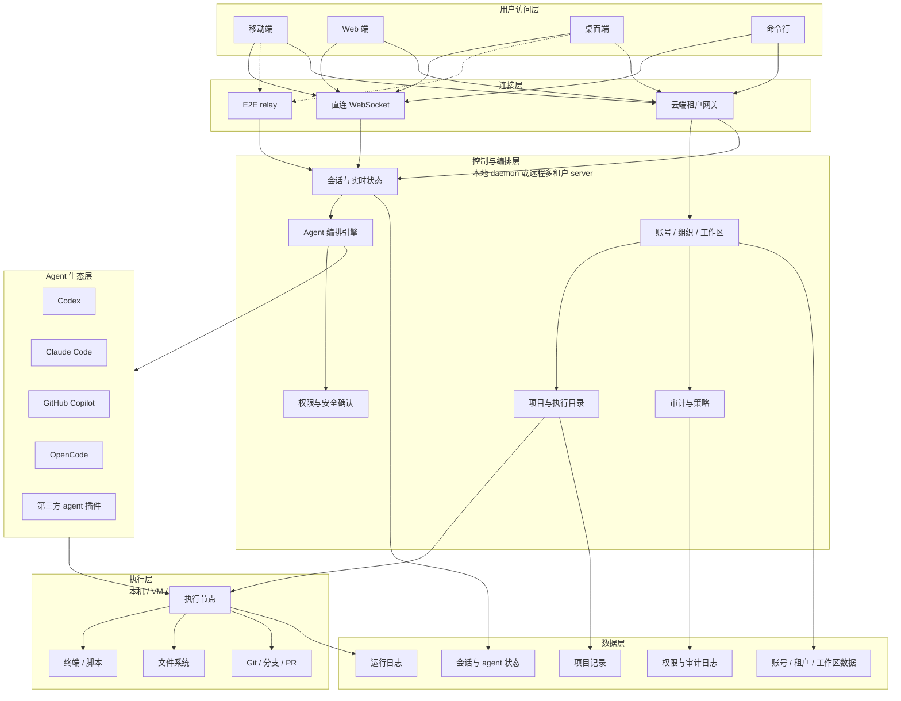
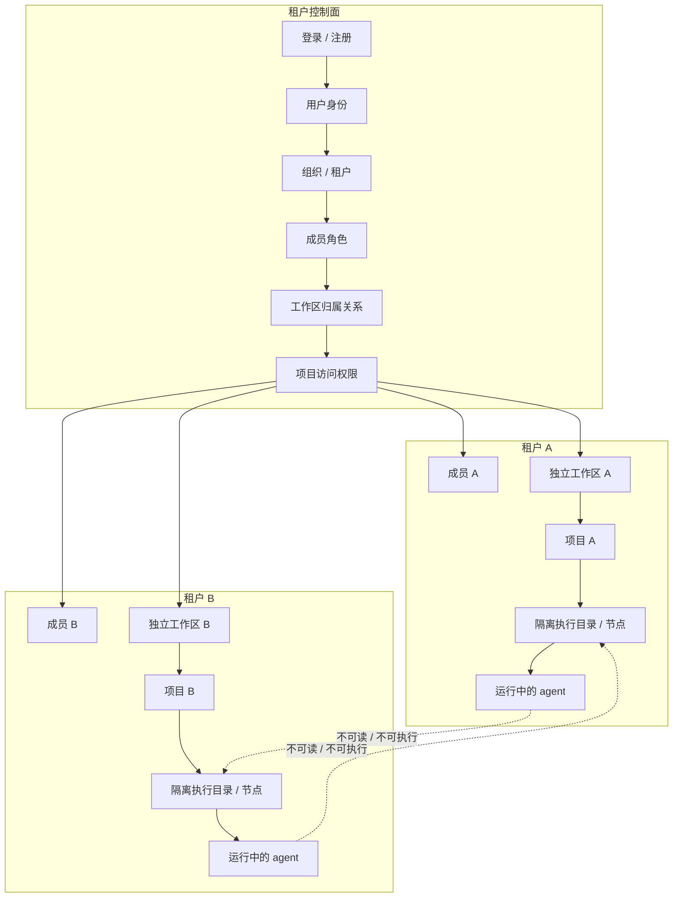
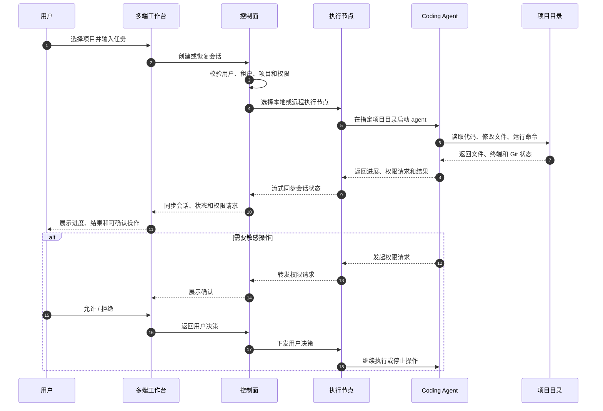
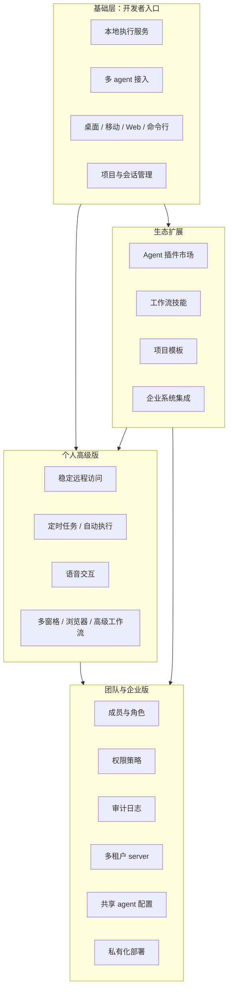
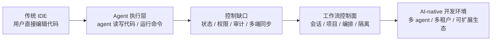

# 架构图

## 1. 产品闭环图

架构重点：

- 核心对象是用户、工作台、工作区、agent 和交付结果。
- 工作台负责项目入口、会话状态、权限确认和 agent 编排。
- 工作区是执行边界，承载项目目录、文件系统、终端和 Git 状态。
- agent 在真实工程上下文中执行任务，结果沉淀回项目，而不是停留在聊天记录里。

## 2. 部署形态图

架构重点：

- 同一套执行模型覆盖本地桌面 runtime 和远程 runtime：control 负责商业、账号、session 和调度，daemon 负责实际执行。
- 本地形态中，下载的桌面客户端内置并管理 daemon；代码、密钥、依赖、终端和 agent 进程留在用户机器。
- 远程形态中，control 选择托管或自有执行节点；具体任务下发到隔离 runtime。
- Relay 独立于 control，只负责在客户端无法直连 runtime daemon 时转发端到端加密流量。

## 3. 整体架构图

架构重点：

- 访问层包含移动端、Web、桌面端和 CLI，所有客户端通过统一协议访问会话和 agent 状态。
- 连接层拆分为直连 WebSocket、端到端加密 relay、云端租户网关三类入口。
- 控制与编排层负责账号/组织/工作区、会话状态、agent 编排、权限确认、审计策略和项目到执行目录的映射。
- 执行层负责真实开发环境中的文件系统、终端、脚本、Git 和 agent 进程。
- 数据层保存账号/租户/工作区数据、项目记录、会话状态、权限审计和运行日志。

## 4. 多租户工作区隔离图

架构重点：

- 多租户层级是租户、成员/角色、工作区、项目、执行节点。
- 权限校验发生在项目被打开、会话被创建、agent 被启动和敏感操作被确认之前。
- 项目是 agent 的最小授权执行边界；每个项目映射到独立执行目录或隔离执行节点。
- 隔离模型需要同时约束可见数据、可执行命令、运行日志和审计归属。

## 5. Agent 执行链路图

架构重点：

- 用户请求先进入控制面，控制面完成用户、租户、项目和权限校验。
- 控制面根据项目路由选择本地或远程执行节点，并在指定项目目录启动 agent。
- 执行节点负责读取代码、修改文件、运行命令、维护终端/Git 状态，并把会话事件流式回传给控制面。
- 权限请求沿 agent、执行节点、控制面、客户端链路返回给用户确认，再由控制面下发决策。
- 会话状态由控制面统一同步，多端客户端看到同一个 agent 生命周期和时间线。

## 6. 数据安全边界图

```mermaid
flowchart LR
  subgraph Execution["执行环境<br/>用户设备 / 自有服务器 / 托管节点"]
    Code["代码仓库"]
    Key["模型账号 / API Key"]
    Env["开发环境<br/>依赖 / 终端 / Git"]
    Runtime["Doya 执行服务"]
    Agent["Agent 进程"]
  end

  subgraph Control["控制与连接面"]
    LocalDaemon["本地 daemon<br/>个人控制面"]
    TenantServer["多租户 server<br/>账号 / 权限 / 审计"]
    Relay["端到端加密通道<br/>只转发密文"]
  end

  subgraph Clients["用户入口"]
    Phone["手机"]
    Browser["浏览器"]
    Desktop["桌面端"]
  end

  Code --> Runtime
  Key --> Agent
  Env --> Agent
  Runtime --> Agent
  Agent --> Code

  Phone <-->|"直连"| LocalDaemon
  Phone -.->|"relay"| Relay
  Phone <-->|"云端登录"| TenantServer
  Browser <-->|"直连"| LocalDaemon
  Browser <-->|"云端登录"| TenantServer
  Desktop <-->|"本机直连"| LocalDaemon
  Desktop -.->|"relay"| Relay
  Desktop <-->|"云端登录"| TenantServer

  LocalDaemon --> Runtime
  TenantServer --> Runtime
  Relay -.->|"密文转发"| LocalDaemon
```

架构重点：

- 代码仓库、模型账号/API Key、依赖、终端和 Git 状态属于执行环境。
- 本地 daemon 是个人形态的控制面，直接管理同一机器或自有服务器上的执行服务。
- 多租户 server 是团队形态的控制面，管理账号、权限、审计和执行节点路由。
- Relay 不保存业务数据，不读取代码内容，只转发客户端与本地 daemon 之间的端到端加密流量。
- 安全边界需要分别落在租户、项目、执行节点、agent 进程和连接通道上。

## 7. 商业化分层图

架构重点：

- 基础层是本地执行服务、多 agent 接入、多端客户端、项目和会话管理。
- 个人高级能力建立在本地 daemon 之上，包括稳定远程访问、自动化、语音和高级工作流。
- 团队与企业能力建立在多租户 server 之上，包括成员角色、权限策略、审计日志、共享 agent 配置和私有化部署。
- 生态扩展层包括 agent 插件、工作流技能、项目模板和企业系统集成，可以同时服务个人版和团队版。

## 8. 架构演进图

架构重点：

- 架构假设从“开发者直接编辑代码”转向“开发者编排 agent 执行工程任务”。
- 系统需要解决 agent 工具分散、状态不可见、权限不可控、执行结果难追踪的问题。
- 控制面成为长期稳定层，底层模型和 agent provider 可以持续替换。
- 工作台、协议、执行节点和生态层共同组成 AI-native 开发工作流入口。
