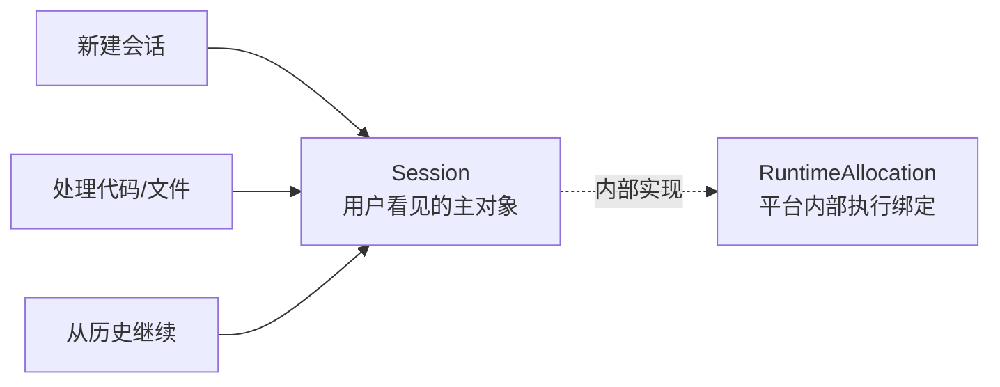
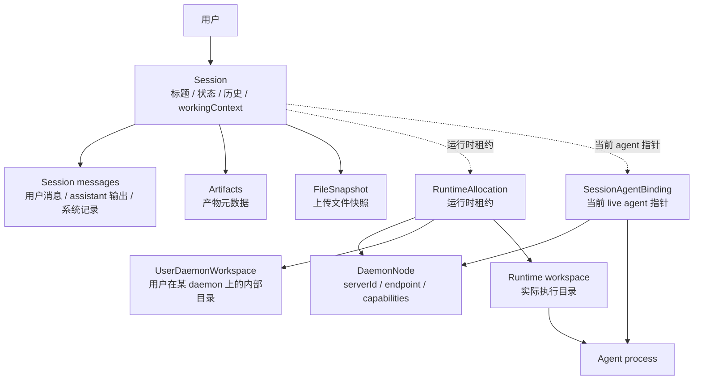
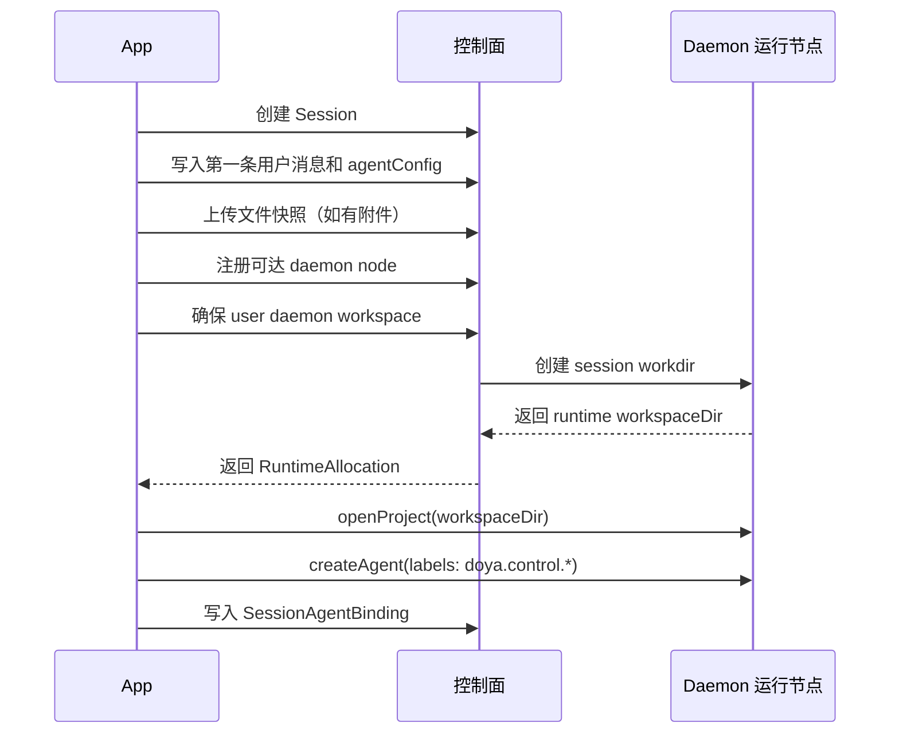

# 产品形态

Doya 的用户产品心智保持为：

```text
新建会话 -> 在会话中处理一份代码/文件 -> 从历史继续
```



用户看到的是会话和历史，不是 daemon、host、runtime、`DOYA_HOME` 或端口。

## 用户看见的世界

用户的核心对象只有 **Session**：

- 新建 Session：描述这次要处理的代码、文件或问题。
- 继续 Session：从历史里恢复上下文，不关心上次在哪台 daemon 上跑。
- 查看 Session 结果：消息历史、产物、状态、需要输入/审批的地方都挂在 Session 上。

产品文案可以继续用“会话/历史/agent/文件”这些用户能理解的词。不要把
daemon node、runtime allocation、workspaceDir、`DOYA_HOME`、端口暴露成用户需要
选择或理解的概念。

## 对象模型



这张图里的实线表示“长期归属”，虚线表示“当前运行时连接”。Session 是用户历史；
RuntimeAllocation 和 SessionAgentBinding 是把这段历史临时接到某个 daemon 执行环境的索引。

## Session、Runtime、Agent

这三个词描述同一段工作的不同层级：

```text
Session  是产品对象：用户创建、继续、查看历史的那段工作。
Runtime  是执行环境：某个 Session 被安排到某台 daemon 的某个工作目录里运行。
Agent    是执行者：在 Runtime 里真正跑起来的 AI 编码任务。
```

用户创建的是 Session，不是 Runtime，也不是 Agent。Runtime 和 Agent 都是平台为了把
Session 跑起来而创建的内部对象。

### Agent 是执行者

**Agent** 指 daemon 里实际运行的一次 AI 编码任务。它由某个 provider 启动，例如
Claude Code、Codex、GitHub Copilot ACP、OpenCode 或 Pi。

一个 Agent 有自己的：

- `agentId`
- provider/model/mode
- `cwd`
- timeline
- permission requests
- running/done/error 状态

用户给会话发消息、看输出流、处理权限请求、停止运行，最终都是在和这个 Agent 交互。
但 Agent 不是长期历史。Agent 所在 daemon 被清理、进程退出或记录丢失后，Session 仍然
应该存在。

### Runtime 是执行环境

**RuntimeAllocation** 记录 Session 当前或曾经被安排到哪里执行：

```text
RuntimeAllocation
  runtimeId
  sessionId
  nodeId
  providerId / modelId
  selectionReason
  workspaceDir
  status
  lastHeartbeatAt
```

它回答的是：

```text
这个 Session 用哪个 provider/model，跑在哪台 daemon 的哪个目录？
```

`selectionReason` 是管理端解释调度结果的字段。它不是用户历史的一部分，而是回答
“为什么这次会话被分配到这台 daemon”。常见值包括：

- `user_workspace_affinity`：用户已有工作区在该 daemon 上，复用本地性。
- `lowest_load`：多个候选 daemon 都可用，选择负载最低者。
- `least_active_online`：本地 control 实现当前按在线 daemon 的 active runtime 数选择。
- `provider_available`：只有这台 daemon 上该 provider/model 可用。

### SessionAgentBinding 是 live 指针

**SessionAgentBinding** 记录 Session 当前应该打开哪个 live Agent：

```text
SessionAgentBinding
  sessionId
  nodeId
  agentId
  workspaceId / cwd
  status
```

它回答的是：

```text
这个 Session 现在对应哪个 daemon 上的哪个 agent？
```

打开历史 Session 时，App 会先读 binding，再去对应 daemon 上确认 `agentId` 仍然存在。
如果找不到，这个 binding 就是 stale。stale binding 只能作为恢复线索，不能当成
Session 的长期事实。

### 一个例子

```text
Session
  id: ses_login_page
  title: "帮我实现登录页"

RuntimeAllocation
  runtimeId: rt_ses_login_page
  nodeId: daemon_macbook
  providerId: codex
  modelId: gpt-5-codex
  selectionReason: least_active_online
  workspaceDir: ~/.doya/runtimes/rt_ses_login_page/workspace
  status: running

SessionAgentBinding
  sessionId: ses_login_page
  nodeId: daemon_macbook
  agentId: agent_codex_123
  status: active

Agent
  agentId: agent_codex_123
  provider: codex
  cwd: ~/.doya/runtimes/rt_ses_login_page/workspace
```

这四个对象的关系是：

```text
Session 保存历史。
RuntimeAllocation 保存执行位置。
SessionAgentBinding 保存当前 live agent 指针。
Agent 执行实际 AI 编码任务。
```

## 归属边界

持久的用户数据属于 control plane：

- users：用户身份和登录态
- sessions：列表、标题、状态、`workingContext`
- session messages：用户消息、assistant 输出、系统绑定记录
- artifacts：产物元数据和 runtime artifact 索引
- file snapshots：上传文件内容快照
- daemon nodes：可用 daemon 的登记表和内部 runtime auth token
- user daemon workspaces：用户在某个 daemon node 上的内部基础目录
- runtime allocation 记录
- session-agent bindings：Session 当前对应的 live daemon agent 指针

daemon node 只拥有运行时数据：

- `$DOYA_HOME/runtimes/{runtimeId}/workspace`
- agent 进程
- terminal/PTY
- 本地日志、缓存、临时文件

关键规则：

```text
Session 不绑定 daemon。
RuntimeAllocation 才绑定 daemon node。
cwd / workspaceDir 只属于 runtime，不属于全局 session/project。
```

控制面里的 daemon node 使用 daemon `serverId` 作为 `nodeId`。runtime lease
返回 allocation 和被选中的 node，App 用这个 `nodeId` 连接已有的 HostRuntime，
不用把 daemon 细节暴露给用户。

旧 `accounts.projects.cwd` 是兼容字段。它可以帮助打开 legacy 本地项目，但不能作为长期会话主数据。

## 新建会话

新建 Session 时，App 先把用户意图写入 control plane，再选择一个可用 daemon 执行：



创建完成后，用户继续看见的是“一个会话正在跑”。内部发生的是：

- Session 记录长期历史。
- RuntimeAllocation 记录这次使用哪个 provider/model、跑在哪个 daemon node、哪个 `workspaceDir`。
- SessionAgentBinding 记录当前 live agent 的 `nodeId + agentId`。
- Agent labels 让 daemon 能把 timeline 事件同步回 control plane。

## Provider 和 Daemon 的关系

Provider 是 daemon 的执行能力，不是独立于 daemon 的全局开关。同一个 provider 在不同
daemon 上可以有不同状态：

```text
MacBook-Pro
  Claude: available, enabled, 10 models
  Codex: available, enabled, 4 models

Linux-Server
  Claude: unauthenticated
  Codex: available, disabled
```

用户创建 Session 时选择的是想用的 provider/model；control plane 负责找到满足条件的
daemon。管理端里的 Provider 开关语义是：

```text
禁用某台 daemon 上的 provider，只影响这台 daemon 是否接收该 provider 的新 runtime。
它不停止已有 runtime，也不删除 Session 历史。
```

这和 daemon `draining` 是两个粒度：

- `draining daemon`：整台 daemon 不再接任何新 runtime，已有 runtime 继续跑。
- `disable provider`：这台 daemon 不再接某个 provider 的新 runtime，其他 provider 仍可调度。

新 runtime 不使用默认 daemon 概念。Control plane 必须通过调度策略选择候选 daemon；
offline 和 draining daemon 都不能接收新 runtime。没有可用候选时提示没有可用执行节点。

## Provider-aware 调度

目标调度接口不是“找一台 daemon”，而是“为这次 provider/model 选择 runtime node”：

```ts
selectRuntimeNode({
  userId,
  providerId,
  modelId,
});
```

候选 daemon 必须满足：

- daemon `status === "online"`。
- daemon 不是 `draining`。
- 该 daemon 上的 `providerId` 是 enabled。
- 该 daemon 上的 `providerId` 是 available，不是未安装、未认证或错误。
- 如果指定 `modelId`，该 daemon 的 provider capability 必须包含该 model。
- CPU、内存、磁盘没有超过硬限制。

候选排序：

- 用户已有 `UserDaemonWorkspace` 所在 daemon 优先。
- running runtime 少、CPU/内存/磁盘压力低的 daemon 优先。
- 选择结果必须写入 `RuntimeAllocation.selectionReason`，用于管理端解释。

调度返回：

```ts
{
  nodeId: "srv_xxx",
  providerId: "claude",
  modelId: "claude-sonnet-4",
  reason: "least_active_online",
}
```

Legacy non-control workspaces may still use the current direct host. Control
sessions must ask the scheduler before opening a runtime workspace and write the
returned `selectionReason` into RuntimeAllocation.

## 继续会话

继续历史 Session 时，App 先从 control plane 读长期事实，再尝试接回 live runtime：

```text
sessionId
  -> Session + messages + artifacts
  -> active SessionAgentBinding
  -> nodeId + agentId
  -> HostRuntime connection
  -> fetchAgent(agentId)
```

如果 agent 还存在，App 直接跳到对应 agent 页面。如果 agent 不存在，当前实现会展示恢复错误；
目标行为是把旧 binding 当成 stale，根据 Session 的 `workingContext` 和第一条用户消息里的
`agentConfig` 重新分配 runtime 并创建 agent。

## 迁移期规则

- 新 durable 功能优先建模为 Session，不再新增依赖 `accounts.projects.cwd` 的历史语义。
- `cwd`、`workspaceId`、`workspaceDir` 可以出现在 runtime allocation 或 binding 里，但不能成为 Session 主键。
- legacy account project 只能在确认属于当前 direct host 时复用，避免把 6767 的本机路径拿给 6868 使用。
- UI 可以在迁移期继续显示 Project/Workspace 结构，但用户历史的目标对象是 Session。
- daemon node 可替换；删除或丢失 daemon 不应删除用户 Session、messages、artifacts 或 file snapshots。

## 管理端

Session-centered 产品面之外，需要一个面向 owner/operator 的管理端。它管理
daemon 和 runtime 资源，不是普通用户的新建/继续会话入口。

管理端的核心问题：

```text
有哪些 daemon 可用？
默认把新 session 分配到哪里？
每个 daemon 上有哪些用户目录、runtime workspace 和 live session？
哪些工作目录已经没有对应 session 或 runtime，可以清理？
每个 daemon 当前负载如何，是否应该继续接新任务？
```

### Daemon 管理

管理端应展示当前登记的 daemon nodes：

- `nodeId`：daemon 的稳定 `serverId`。
- `endpoint`：control plane 调 daemon runtime API 的地址。
- `status`：`online` / `offline` / `draining`。
- `capabilities`：daemon 支持的 provider、runtime API、平台能力等。
- `lastHeartbeatAt`：最近一次心跳或 runtime-sync 时间。
- `doyaHome`：仅管理端可见，用于判断工作目录归属。
- 当前 runtime 数、running agent 数、排队/失败/丢失 runtime 数。
- Provider 能力：每台 daemon 上 Claude、Codex、Copilot、OpenCode、Pi 等 provider 的
  enabled/available/model/error 状态。

管理操作：

- 添加 daemon：录入 endpoint 和可选 runtime auth token，注册为 `DaemonNode`。
- 标记 draining：不再接收新 runtime，但保留已有 runtime 直到停止或迁移。
- 标记 offline/lost：用于 daemon 不可达时停止调度。
- 启用/禁用 provider：只影响该 daemon 是否接收该 provider 的新 runtime。
- 编排设置：每台 daemon 独立配置是否向新 agent 注入 Doya tools，以及追加给新 agent 的系统提示词。
- 重启 daemon：请求 daemon 自身重启，客户端连接会在进程恢复后重连。
- 删除 daemon：只删除 node 登记，不删除 Session 历史；相关 allocation 应标记为 `lost` 或等待显式清理。

### 管理端访问

Daemon 管理和服务商管理是 owner/operator 工具，不是普通会话路径。它们不出现在设置页
导航里，只能通过直接 URL 进入，例如 `/admin/daemons`。进入前需要本地管理密码确认。

这个密码门禁只用于避免误入管理界面，不是 daemon 的安全边界。真正的访问控制仍然来自
daemon auth、relay pairing、网络可达性和本机权限。

### 用户目录与会话管理

管理端需要按 daemon 查看用户目录和会话运行关系：

```text
DaemonNode
└── UserDaemonWorkspace
    ├── RuntimeAllocation
    │   └── Session
    └── orphan workspace dirs
```

需要支持：

- 查看某个 daemon 上每个用户的 `UserDaemonWorkspace`。
- 查看 workspace 下有哪些 runtime workdirs、对应哪个 `sessionId`。
- 查看某个 Session 当前绑定的 `nodeId + runtimeId + workspaceDir + agentId`。
- 批量删除已删除 Session 对应的工作目录。
- 批量删除没有任何 Session/RuntimeAllocation 记录的孤儿工作目录。
- 删除工作目录前给出 dry-run 列表：路径、大小、mtime、关联 session/runtime 状态。
- 删除工作目录只影响 daemon-local runtime 文件，不删除 control plane 的 Session 历史，除非用户明确选择删除 Session。

当前本地实现先落地会话关联清理：

- App 管理页为 `/admin/daemons`，只通过直接 URL 进入，并由本地管理密码门禁保护。
- `GET /api/admin/daemon-overview` 返回 daemon、负载、用户 workspace、Session、RuntimeAllocation 和 SessionAgentBinding 汇总。
- 管理端中的 Provider 模块属于 daemon 详情：从 daemon 视角看它具备哪些执行能力、每项能力是否接新任务。
- `GET /api/admin/nodes/:nodeId/config` / `PATCH /api/admin/nodes/:nodeId/config` 读取和修改某台 daemon 的 Doya tools 注入与系统提示词配置；这些配置只影响该 daemon 上新启动的 agent。
- `POST /api/admin/nodes/:nodeId/cleanup-sessions` 支持批量清理选中的 Session：软删除 control Session、停止对应 RuntimeAllocation、归档对应 SessionAgentBinding，并通过 daemon 的 `DELETE /api/user-workspaces/session-workdirs` 删除对应 session workdir。
- 已删除但仍有关联 RuntimeAllocation/SessionAgentBinding 的 Session 仍会显示在管理端，便于补删工作目录。
- 没有任何 control 记录的 orphan 目录扫描和 dry-run 大小估算仍属于下一步 daemon-local inventory 能力。

清理必须以 control plane 记录为准：

- `Session.deletedAt != null` 且没有 running runtime：可以清理对应 runtime workspace。
- `RuntimeAllocation.status in ("stopped", "lost")`：可以进入候选清理列表。
- 找不到对应 `Session` 的工作目录：作为 orphan，需要管理端确认后删除。
- `running` runtime 的工作目录不能批量删除，除非先 stop runtime。

### 负载观察

管理端需要看到 daemon 的负载情况，供调度决策使用：

- CPU、内存、磁盘剩余空间。
- running/stopped/lost runtime 数量。
- running agent 数量和 provider 分布。
- 最近 runtime 创建失败数。
- 最近 timeline-sync/error 频率。
- 工作目录总占用空间，以及可清理空间估算。

这些负载数据属于 daemon runtime facts。control plane 可以保存最近快照用于调度，
但不应把它们当成用户历史。

### 权限边界

管理端可以管理执行资源，但默认不展示用户消息正文。需要排查时可以通过显式权限查看
Session 元数据、状态和路径关系；消息内容、文件快照和 artifacts 内容应按更高权限处理。
